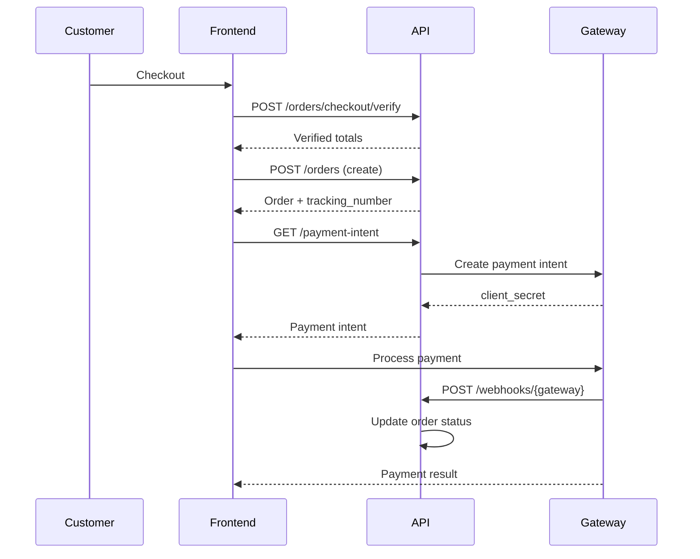

# Request for detailed backend documentation
_Exported on 12/3/2025 at 11:13:02 GMT+2 from Cursor (2.1.42)_

---

**User**

@chawkbazar-api Provide a detailed documentation that contains the features of this system like authentication, checkout ...etc with a brief description and business rules for each feature, what's missing or wrong with it and list routes of the endpoints for each feature within every feature's section. @PROJECT_ANALYSIS.md @project-refactor-plan.md  provided to you the codebase ( priority ) and documntations about the project. Include the Backend only.

---

**Cursor**

I'll analyze the ChawkBazar API backend to provide comprehensive documentation. Let me start by exploring the structure and routes.

Now let me read a few more key files to complete my understanding of the refund system, flash sales, and conversations features.

Based on my analysis of the ChawkBazar API backend codebase, here's the comprehensive documentation:

---

# **ChawkBazar API Backend Documentation**

## **Table of Contents**
1. [Architecture Overview](#architecture-overview)
2. [Authentication & Authorization](#1-authentication--authorization)
3. [User Management](#2-user-management)
4. [Multi-Vendor Shop Management](#3-multi-vendor-shop-management)
5. [Product Management](#4-product-management)
6. [Order & Checkout System](#5-order--checkout-system)
7. [Payment Integration](#6-payment-integration)
8. [Wallet & Loyalty Points](#7-wallet--loyalty-points)
9. [Commission System](#8-commission-system)
10. [Refund Management](#9-refund-management)
11. [Coupon & Discount System](#10-coupon--discount-system)
12. [Flash Sales](#11-flash-sales)
13. [Messaging System](#12-messaging-system)
14. [Reviews & Questions](#13-reviews--questions)
15. [Wishlist](#14-wishlist)
16. [Settings & Configuration](#15-settings--configuration)
17. [Critical Issues & Missing Features](#critical-issues--missing-features)

---

## **Architecture Overview**

**Framework:** Laravel 10.30.1  
**PHP Version:** 8.0/8.1  
**Architecture Pattern:** Repository Pattern with Service Layer  
**Authentication:** Laravel Sanctum (Token-based)  
**Authorization:** Spatie Permissions (Role & Permission based)

### **Permission Levels:**
- `super_admin` - Platform administrator
- `store_owner` - Vendor/shop owner
- `staff` - Shop staff member
- `customer` - Regular customer

---

## **1. Authentication & Authorization**

### **Description:**
Token-based authentication system supporting multiple login methods including email/password, social login (Google/Facebook), and OTP-based login.

### **Business Rules:**
1. **Email Verification:** Optional (configurable via settings `useMustVerifyEmail`)
2. **Default Behavior:** Users are auto-verified on registration (security concern)
3. **Social Login:** Creates account automatically if email doesn't exist
4. **OTP Login:** Supports phone-based authentication via configurable gateway
5. **Password Reset:** Token-based with email verification
6. **License Key:** System requires valid license key verification

### **API Endpoints:**

```http
# Public Authentication Endpoints
POST   /api/register                      # Register new user
POST   /api/token                         # Login with email/password
POST   /api/logout                        # Logout (revoke token)
POST   /api/social-login-token            # OAuth login (Google/Facebook)
POST   /api/otp-login                     # Login with OTP
POST   /api/send-otp-code                 # Send OTP to phone
POST   /api/verify-otp-code               # Verify OTP code

# Password Management
POST   /api/forget-password               # Request password reset
POST   /api/verify-forget-password-token  # Verify reset token
POST   /api/reset-password                # Reset password with token

# Authenticated Only
POST   /api/change-password               # Change password (requires auth)
GET    /api/me                            # Get current user profile
POST   /api/update-email                  # Update user email
GET    /api/email/verify/{id}/{hash}      # Email verification link
POST   /api/email/verification-notification # Resend verification email
```

### **Critical Issues:**

❌ **SECURITY FLAW - Auto Email Verification:** Lines 300, 490, 627 in `UserController.php` automatically set `email_verified_at` on registration. This bypasses email verification completely.

```php
// WRONG: Auto-verified on registration
'email_verified_at' => now(),
```

**Recommendation:** Remove auto-verification and enforce email verification:
```php
'email_verified_at' => null, // Let verification flow handle this
```

❌ **Missing Rate Limiting:** Authentication endpoints lack rate limiting (except verification email which has `throttle:6,1`)

❌ **Weak Password Policy:** No password complexity requirements enforced

❌ **No MFA Support:** System lacks two-factor authentication

❌ **Application Validation:** Line 261 in `UserController.php` checks `applicationIsValid` but returns `null` token instead of throwing proper error

---

## **2. User Management**

### **Description:**
Comprehensive user management system supporting customers, vendors, staff, and administrators with profile management and address handling.

### **Business Rules:**
1. **User Types:** Differentiated by permissions (not by user type field)
2. **Profiles:** Separate `Profile` model with avatar, bio, contact
3. **Addresses:** Users can have multiple addresses
4. **Wallet:** Each customer gets a wallet for points
5. **Shops:** Vendors can own multiple shops
6. **Staff Assignment:** Staff members are assigned to specific shops
7. **User Blocking:** Admin can ban users (sets `is_active = false`)

### **API Endpoints:**

```http
# Admin Only
GET    /api/users                         # List all users
POST   /api/users                         # Create user (admin)
GET    /api/users/{id}                    # Get user details
PUT    /api/users/{id}                    # Update user
DELETE /api/users/{id}                    # Delete user
GET    /api/admin/list                    # List admins
GET    /api/customers/list                # List customers
GET    /api/vendors/list                  # List vendors (store owners)
POST   /api/users/block-user              # Ban user
POST   /api/users/unblock-user            # Unban user
POST   /api/users/make-admin              # Grant/revoke admin permission
POST   /api/add-points                    # Add wallet points to customer

# Store Owner Only
GET    /api/staffs                        # List shop staff
POST   /api/staffs                        # Add staff to shop
DELETE /api/staffs/{id}                   # Remove staff
GET    /api/my-staffs                     # Get owner's staffs
GET    /api/all-staffs                    # Get all staffs (admin)

# Authenticated Users
PUT    /api/users/{id}                    # Update own profile
POST   /api/update-contact                # Update phone number (with OTP)

# Address Management (Authenticated)
DELETE /api/address/{id}                  # Delete address

# Misc
POST   /api/contact-us                    # Contact admin
POST   /api/subscribe-to-newsletter       # Mailchimp subscription
```

### **Critical Issues:**

❌ **No Transaction Wrapper:** User creation doesn't use DB transactions. If profile/wallet creation fails, orphan user record remains.

❌ **IDOR Vulnerability:** Line 248 in `UserController.php` allows users to update own profile but validation is weak:
```php
elseif ($request->user()->id == $id) {
    $user = $request->user();
    return $this->repository->updateUser($request, $user);
}
```

❌ **Soft Deletes Missing Cascade:** Deleting user doesn't handle related data (orders, reviews, etc.)

❌ **No Email Uniqueness on Update:** `updateEmail` validates uniqueness but doesn't prevent race conditions

---

## **3. Multi-Vendor Shop Management**

### **Description:**
Multi-vendor marketplace functionality where shop owners can create stores, manage products, handle orders, and track earnings with commission-based revenue sharing.

### **Business Rules:**
1. **Shop Approval:** Shops require admin approval before going live
2. **Shop Balance:** Each shop has a balance tracking earnings and withdrawals
3. **Commission System:** Platform takes commission on each sale
4. **Staff Management:** Owners can add staff members to manage shop
5. **Shop Maintenance:** Shops can be put in maintenance mode
6. **Shop Following:** Customers can follow shops
7. **Ownership Transfer:** Shops can be transferred between users

### **API Endpoints:**

```http
# Public
GET    /api/shops                         # List all active shops
GET    /api/shops/{id}                    # Get shop details
GET    /api/near-by-shop/{lat}/{lng}      # Find nearby shops

# Store Owner
POST   /api/shops                         # Create new shop
PUT    /api/shops/{id}                    # Update shop
DELETE /api/shops/{id}                    # Delete shop
GET    /api/my-shops                      # Get owner's shops
POST   /api/transfer-shop-ownership       # Initiate ownership transfer

# Admin Only
POST   /api/approve-shop                  # Approve shop
POST   /api/disapprove-shop               # Reject/disable shop
GET    /api/new-shops                     # List pending shops

# Authenticated Customers
GET    /api/followed-shops                # Get followed shops
GET    /api/follow-shop                   # Check if following shop
POST   /api/follow-shop                   # Toggle follow shop
GET    /api/followed-shops-popular-products # Products from followed shops

# Events
POST   /api/shop-maintenance-event        # Trigger maintenance mode

# Ownership Transfer (Admin & Owner)
GET    /api/ownership-transfer            # List transfer requests
GET    /api/ownership-transfer/{id}       # Get transfer details
PUT    /api/ownership-transfer/{id}       # Process transfer
DELETE /api/ownership-transfer/{id}       # Cancel transfer
```

### **Models & Relationships:**

**Shop Model:**
- `id`, `name`, `slug`, `description`, `cover_image`, `logo`
- `is_active` - Shop status
- `owner_id` - FK to users table
- `address` (JSON) - Shop location
- `settings` (JSON) - Shop-specific settings

**Relationships:**
- `owner()` - BelongsTo User
- `balance()` - HasOne Balance
- `products()` - HasMany Product
- `orders()` - HasMany Order
- `staffs()` - HasMany User
- `categories()` - BelongsToMany Category
- `users()` - BelongsToMany User (followers)

### **Critical Issues:**

❌ **No Transaction for Shop Creation:** Shop creation with balance initialization not wrapped in transaction

❌ **Cascade Deletion:** Deleting shop doesn't properly handle:
   - Active orders
   - Staff assignments
   - Product inventory

❌ **Missing Business Logic:** When user is banned (line 336-342 `UserController.php`), their shops are deactivated but products set to 'draft'. Should instead:
```php
// Better approach:
$shops->each(function($shop) {
    $shop->is_active = false;
    $shop->products()->update([
        'status' => ProductStatus::DRAFT,
        'quantity' => 0  // Prevent orders
    ]);
});
```

❌ **Shop Maintenance:** `shop-maintenance-event` endpoint exists but implementation unclear

---

## **4. Product Management**

### **Description:**
Comprehensive product management with support for simple products, variable products (with variations), digital products, and rental products.

### **Business Rules:**
1. **Product Types:** Simple, Variable, Digital (downloadable)
2. **Product Status:** `publish`, `draft`, `pending`
3. **Stock Management:** Quantity tracking with low-stock alerts
4. **Variations:** Products can have variations (size, color, etc.)
5. **Categories & Tags:** Multi-category assignment
6. **Flash Sales:** Products can be part of flash sales
7. **Rental Products:** Support for date-based booking
8. **Digital Products:** File attachments for digital downloads
9. **AI Description:** OpenAI integration for product descriptions

### **API Endpoints:**

```http
# Public
GET    /api/products                      # List products (paginated)
GET    /api/products/{id}                 # Get product details
GET    /api/popular-products              # Get popular products
GET    /api/best-selling-products         # Get best sellers
GET    /api/check-availability            # Check product availability
GET    /api/products/calculate-rental-price # Calculate rental pricing

# Authenticated Staff/Owner
POST   /api/products                      # Create product
PUT    /api/products/{id}                 # Update product
DELETE /api/products/{id}                 # Delete product
GET    /api/draft-products                # List draft products
GET    /api/products-stock                # Stock levels report

# Import/Export
POST   /api/import-products               # Bulk import products
POST   /api/import-variation-options      # Import variations
GET    /api/export-products/{shop_id}     # Export to Excel
GET    /api/export-variation-options/{shop_id} # Export variations

# AI Features
POST   /api/generate-description          # Generate AI description

# Customer Wishlists
GET    /api/my-wishlists                  # Get user's wishlist products
```

### **Models & Relationships:**

**Product Model:**
- Core fields: `name`, `slug`, `description`, `type_id`, `shop_id`
- Pricing: `price`, `sale_price`, `min_price`, `max_price`
- Inventory: `quantity`, `unit`, `sku`
- Media: `image` (JSON), `gallery` (JSON), `video` (JSON)
- Status: `status`, `visibility` (public/private)
- Metadata: `author_id`, `manufacturer_id`, `shipping_class_id`

**Relationships:**
- `shop()` - BelongsTo Shop
- `type()` - BelongsTo Type
- `categories()` - BelongsToMany Category
- `tags()` - BelongsToMany Tag
- `variations()` - HasMany Variation
- `reviews()` - HasMany Review
- `orders()` - BelongsToMany Order

### **Critical Issues:**

❌ **No Stock Validation:** Order creation doesn't check stock before allowing purchase (race condition)

❌ **Missing Soft Delete Cascade:** Product deletion doesn't handle:
   - Active cart items
   - Pending orders
   - Wishlists

❌ **Variation Stock:** Variation-level stock tracking exists but not consistently enforced

❌ **No Inventory Reservation:** When order is created but payment pending, stock isn't reserved

**Recommended Fix:**
```php
// In OrderRepository::storeOrder()
DB::transaction(function() use ($request) {
    // 1. Lock products for update
    $products = Product::whereIn('id', $productIds)
        ->lockForUpdate()
        ->get();
    
    // 2. Validate stock
    foreach ($products as $product) {
        if ($product->quantity < $requestedQty) {
            throw new InsufficientStockException();
        }
    }
    
    // 3. Create order
    $order = Order::create([...]);
    
    // 4. Reserve stock
    foreach ($products as $product) {
        $product->decrement('quantity', $requestedQty);
    }
});
```

---

## **5. Order & Checkout System**

### **Description:**
Complete order management system with multi-vendor order splitting, guest checkout, order tracking, and comprehensive order status workflow.

### **Business Rules:**
1. **Order Splitting:** Single cart checkout creates parent order + child orders per shop
2. **Guest Checkout:** Optional (configurable via `guestCheckout` setting)
3. **Order Statuses:** pending → processing → completed/cancelled/refunded
4. **Tracking Number:** Unique tracking number generated per order
5. **Payment Status:** Independent from order status
6. **Wallet Payment:** Can use wallet points to pay full/partial amount
7. **Shipping & Tax:** Calculated during checkout verification
8. **Coupon Application:** Discounts applied at checkout

### **Order Status Flow:**
```
PENDING → PROCESSING → AT_LOCAL_FACILITY → OUT_FOR_DELIVERY → COMPLETED
        ↓                                                      ↑
        ↓                                                      ↑
    CANCELLED/FAILED ←←←←←←←←←←←←←←←←←←←←←←←←←←←←←←←←←←←←←← REFUNDED
```

### **API Endpoints:**

```http
# Checkout Process
POST   /api/orders/checkout/verify        # Verify checkout data (tax, shipping)
POST   /api/orders                        # Create order
POST   /api/orders/payment                # Submit payment for order

# Order Management
GET    /api/orders                        # List orders (role-based)
GET    /api/orders/{tracking_number}      # Get order details
PUT    /api/orders/{id}                   # Update order status
DELETE /api/orders/{id}                   # Delete order (admin only)
GET    /api/orders/tracking-number/{tracking_number} # Track order

# Order Export
GET    /api/export-order-url/{shop_id}    # Generate export URL
GET    /api/export-order/token/{token}    # Download Excel export

# Invoice
POST   /api/download-invoice-url          # Generate invoice URL
GET    /api/download-invoice/token/{token} # Download PDF invoice

# Payment Gateway Processing
GET    /api/payment-intent                # Get payment intent
```

### **Models & Relationships:**

**Order Model:**
- Identification: `id`, `tracking_number`, `language`
- Customer: `customer_id`, `customer_name`, `customer_contact`
- Pricing: `amount`, `sales_tax`, `delivery_fee`, `discount`, `paid_total`, `total`
- Status: `order_status`, `payment_status`
- Payment: `payment_gateway`, `payment_id`, `payment_intent_info` (JSON)
- Addresses: `shipping_address` (JSON), `billing_address` (JSON)
- Relationships: `parent_id`, `shop_id`, `coupon_id`

**Relationships:**
- `customer()` - BelongsTo User
- `shop()` - BelongsTo Shop
- `products()` - BelongsToMany Product (pivot: order_quantity, unit_price, subtotal)
- `coupon()` - BelongsTo Coupon
- `children()` - HasMany Order (child orders)
- `parent_order()` - BelongsTo Order
- `wallet_point()` - HasOne OrderWalletPoint
- `refund()` - HasOne Refund

### **Critical Issues:**

❌ **CRITICAL - Transaction Scope Too Narrow:** Line 138 in `OrderController.php`:
```php
return DB::transaction(fn () => $this->repository->storeOrder($request, $this->settings));
```
Transaction only wraps order creation but NOT inventory deduction or payment processing.

**Recommended Fix:**
```php
DB::transaction(function() use ($request, $settings) {
    // 1. Validate & lock inventory
    $this->validateAndLockInventory($request->products);
    
    // 2. Create order
    $order = $this->repository->storeOrder($request, $settings);
    
    // 3. Deduct inventory
    $this->deductInventory($order);
    
    // 4. Process wallet payment if applicable
    if ($request->use_wallet_points) {
        $this->deductWalletPoints($order);
    }
    
    return $order;
});
```

❌ **No Stock Validation:** `storeOrder()` doesn't check product availability before creating order

❌ **Race Condition:** Multiple simultaneous orders for same product can oversell

❌ **Payment Status Inconsistency:** Order can be in "completed" status but payment "pending"

❌ **Missing Rollback Logic:** If payment fails after order creation, inventory isn't restored

❌ **Weak Authorization:** Line 201-208 in `OrderController.php` - authorization logic is complex and error-prone

---

## **6. Payment Integration**

### **Description:**
Multi-gateway payment integration supporting 11+ payment providers with webhook handling for async payment confirmations.

### **Supported Payment Gateways:**
1. **Stripe** - Credit/debit cards
2. **PayPal** - PayPal checkout
3. **Razorpay** - India payments
4. **Mollie** - European payments
5. **Paystack** - African payments
6. **Paymongo** - Philippines
7. **Xendit** - Southeast Asia
8. **Iyzico** - Turkey
9. **Bkash** - Bangladesh
10. **Flutterwave** - Africa
11. **Cash on Delivery (COD)**
12. **Full Wallet Payment**

### **Business Rules:**
1. **Payment Intent:** Created before checkout for supported gateways
2. **Webhook Verification:** Each gateway has dedicated webhook endpoint
3. **Payment Status:** `pending`, `processing`, `success`, `failed`, `reversal`
4. **COD Orders:** Automatically set to "processing" status
5. **Wallet Payment:** If wallet covers full amount, order auto-completed

### **API Endpoints:**

```http
# Payment Processing
GET    /api/payment-intent                # Get/create payment intent
POST   /api/orders/payment                # Submit payment

# Webhooks (Public - No Auth)
POST   /api/webhooks/stripe               # Stripe webhook
POST   /api/webhooks/paypal               # PayPal webhook
POST   /api/webhooks/razorpay             # Razorpay webhook
POST   /api/webhooks/mollie               # Mollie webhook
POST   /api/webhooks/paystack             # Paystack webhook
POST   /api/webhooks/paymongo             # Paymongo webhook
POST   /api/webhooks/xendit               # Xendit webhook
POST   /api/webhooks/iyzico               # Iyzico webhook
POST   /api/webhooks/bkash                # Bkash webhook
POST   /api/webhooks/flutterwave          # Flutterwave webhook
GET    /api/callback/flutterwave          # Flutterwave redirect callback

# Payment Methods (Authenticated)
GET    /api/cards                         # List saved cards
POST   /api/cards                         # Add payment method
PUT    /api/cards/{id}                    # Update payment method
DELETE /api/cards/{id}                    # Delete payment method
POST   /api/set-default-card              # Set default card
POST   /api/save-payment-method           # Save payment method
```

### **Payment Flow:**



### **Critical Issues:**

❌ **SECURITY CRITICAL - Webhook Validation Missing:** Webhook endpoints (lines 95-104 in `Routes.php`) are public with NO signature verification

**Example Fix Needed:**
```php
// In WebHookController::stripe()
public function stripe(Request $request) {
    // MISSING: Signature verification
    $signature = $request->header('Stripe-Signature');
    $webhookSecret = config('services.stripe.webhook_secret');
    
    try {
        $event = \Stripe\Webhook::constructEvent(
            $request->getContent(),
            $signature,
            $webhookSecret
        );
    } catch(\Exception $e) {
        return response()->json(['error' => 'Invalid signature'], 400);
    }
    
    // Now process the event...
}
```

❌ **No Idempotency:** Webhooks can be replayed causing duplicate order updates

❌ **Payment Status Race Condition:** User can submit payment multiple times for same order

❌ **Missing Payment Timeout:** Pending payments never expire

❌ **No Refund API:** System has refund model but no payment gateway refund integration

---

## **7. Wallet & Loyalty Points**

### **Description:**
Customer loyalty system with wallet points that can be earned on signup and used for purchases. Points are convertible to currency based on configurable ratio.

### **Business Rules:**
1. **Signup Bonus:** Customers get points on registration (configurable)
2. **Points Conversion:** Currency to points ratio set in settings (default 1:1)
3. **Points Usage:** Can pay full or partial amount with points
4. **Points Expiry:** No expiration (potential issue)
5. **Points Tracking:** `total_points`, `available_points`, `points_used`
6. **Admin Points:** Super admin can manually add points

### **Wallet Model Fields:**
- `customer_id` (FK to users)
- `total_points` - Lifetime earned points
- `available_points` - Current balance
- `points_used` - Points spent

### **API Endpoints:**

```http
# Admin Only
POST   /api/add-points                    # Add points to customer wallet

# Customer (Implicit)
# Wallet used automatically during checkout if:
# - use_wallet_points = true
# - isFullWalletPayment = true
```

### **Points Flow:**

**Earning Points:**
1. **Registration:** `signupPoints` from settings added to wallet
2. **Manual Addition:** Admin can add points

**Using Points:**
1. **Checkout:** If `use_wallet_points = true`, points deducted
2. **Conversion:** Points converted to currency using `currencyToWalletRatio`
3. **Calculation:** 
   ```php
   $currency = $points / $currencyToWalletRatio;
   $points = $currency * $currencyToWalletRatio;
   ```

### **Implementation Details:**

**From `WalletsTrait.php`:**
```php
// Convert currency to points
private function currencyToWalletPoints($currency) {
    $ratio = $this->currencyToWalletRatio();
    return intval($currency * $ratio);
}

// Convert points to currency
public function walletPointsToCurrency($points) {
    $ratio = $this->currencyToWalletRatio();
    return round($points / $ratio, 2);
}
```

**From `OrderRepository.php` (lines 184-199):**
```php
if (($useWalletPoints || $request->isFullWalletPayment) && $user) {
    $wallet = $user->wallet;
    $amount = round($request['paid_total'], 2) - 
              $this->walletPointsToCurrency($wallet->available_points);
    
    // If wallet covers full amount
    if ($amount <= 0) {
        $request['order_status'] = OrderStatus::COMPLETED;
        $request['payment_gateway'] = PaymentGatewayType::FULL_WALLET_PAYMENT;
        $request['payment_status'] = PaymentStatus::SUCCESS;
        
        $order = $this->createOrder($request);
        $this->storeOrderWalletPoint($request['paid_total'], $order->id);
        $this->manageWalletAmount($request['paid_total'], $user->id);
        
        return $order;
    }
}
```

### **Critical Issues:**

❌ **No Points Earning on Purchase:** System deducts points but never awards them for purchases

❌ **Integer Truncation:** Line 20 in `WalletsTrait.php` - `intval($points)` loses fractional points

❌ **No Transaction Wrapper:** Wallet deduction not in same transaction as order creation (lines 196-198 `OrderRepository.php`)

❌ **Race Condition:** Multiple simultaneous orders can overdraw wallet:
```php
// Current code (WRONG):
$wallet->available_points = $wallet->available_points - $total;

// Should be (CORRECT):
$wallet->lockForUpdate();
if ($wallet->available_points < $total) {
    throw new InsufficientPointsException();
}
$wallet->decrement('available_points', $total);
```

❌ **No Points Expiry:** Points never expire (accounting issue)

❌ **Missing Audit Trail:** No `wallet_transactions` table to track points history

**Recommended Enhancement:**
```php
// Add WalletTransaction model
Schema::create('wallet_transactions', function($table) {
    $table->id();
    $table->foreignId('wallet_id');
    $table->enum('type', ['earn', 'spend', 'admin_add', 'refund']);
    $table->integer('points');
    $table->string('reference_type')->nullable(); // Order, Refund
    $table->unsignedBigInteger('reference_id')->nullable();
    $table->text('description')->nullable();
    $table->timestamps();
});
```

---

## **8. Commission System**

### **Description:**
Tiered commission system where platform takes percentage from vendor sales. Commission rates can be default (tier-based on earnings) or custom per shop.

### **Business Rules:**
1. **Commission Types:**
   - **Multi-tier:** Rate changes based on shop's total earnings
   - **Custom:** Fixed rate set by admin for specific shop
2. **Commission Calculation:** Only on completed orders
3. **Balance Updates:** Vendor balance updated when order status = "completed"
4. **Commission Tiers:** Defined by `min_balance`, `max_balance`, `commission%`
5. **Notifications:** Email sent when tier changes

### **Commission Flow:**

```
Order Created (PENDING) → No commission yet
        ↓
Order Status = COMPLETED → Calculate commission
        ↓
Platform Commission = order.total × (commission_rate / 100)
        ↓
Shop Earnings = order.total - Platform Commission
        ↓
Update shop.balance.total_earnings
Update shop.balance.current_balance
        ↓
Check if tier changed → Send notification
```

### **Commission Model Fields:**
- `level` - Tier level (1, 2, 3...)
- `sub_level` - Sub-tier
- `description` - Tier description
- `min_balance` - Minimum earnings for tier
- `max_balance` - Maximum earnings ("over" for unlimited)
- `commission` - Commission percentage
- `language` - Locale

**Example Tiers:**
```
Level 1: $0 - $1000       → 15% commission
Level 2: $1000 - $5000    → 12% commission
Level 3: $5000 - $10000   → 10% commission
Level 4: $10000+          → 8% commission
```

### **Balance Model Fields:**
- `shop_id`
- `total_earnings` - Lifetime earnings
- `current_balance` - Available for withdrawal
- `admin_commission_rate` - Current commission rate
- `is_custom_commission` - If true, rate is fixed (not tier-based)

### **Implementation:**

**From `OrderStatusManagerWithPaymentTrait.php` (lines 71-109):**
```php
protected function updateBalanceShop($order, $action_type = 'add')
{
    $balance = Balance::where('shop_id', '=', $order->shop_id)->first();
    $settings = Settings::getData();
    $isMultiCommissionRate = $settings['options']['isMultiCommissionRate'];
    
    $adminCommissionDefaultRate = $this->getCommissionRate($total_earnings);
    $adminCommissionCustomRate = $balance->admin_commission_rate;
    
    if ($isMultiCommissionRate) {
        if (!$balance->is_custom_commission) {
            $shop_earnings = ($order->total * (100 - $adminCommissionDefaultRate)) / 100;
        } else {
            $shop_earnings = ($order->total * (100 - $adminCommissionCustomRate)) / 100;
        }
    } else {
        $shop_earnings = ($order->total * (100 - $adminCommissionCustomRate)) / 100;
    }
    
    if ($action_type == 'deduct') $shop_earnings = $shop_earnings * -1;
    
    $balance->total_earnings += $shop_earnings;
    $balance->current_balance += $shop_earnings;
    
    // Check if tier changed
    if ($isMultiCommissionRate && !$balance->is_custom_commission) {
        $updateAdminCommissionRate = $this->getCommissionRate($balance->total_earnings);
        if ($adminCommissionDefaultRate != $updateAdminCommissionRate) {
            event(new CommissionRateUpdateEvent($order->shop, $balance));
        }
        $balance->admin_commission_rate = $updateAdminCommissionRate;
    }
    
    $balance->save();
}
```

### **API Endpoints:**

```http
# Commission management is done through Settings
# No dedicated commission endpoints visible in Routes.php
# Managed via admin settings panel
```

### **Critical Issues:**

❌ **No Commission Model in Routes:** Commission CRUD operations not exposed via API

❌ **Commission Calculation Bug:** Line 81 in `OrderStatusManagerWithPaymentTrait.php`:
```php
$shop_earnings = ($order->total * (100 - $adminCommissionDefaultRate)) / 100;
```
This calculates **shop earnings**, not commission. The commission itself isn't stored anywhere.

**Should be:**
```php
$commission_amount = ($order->total * $adminCommissionDefaultRate) / 100;
$shop_earnings = $order->total - $commission_amount;

// Store commission
PlatformCommission::create([
    'order_id' => $order->id,
    'shop_id' => $order->shop_id,
    'order_total' => $order->total,
    'commission_rate' => $adminCommissionDefaultRate,
    'commission_amount' => $commission_amount,
    'shop_earnings' => $shop_earnings,
]);
```

❌ **No Commission Audit Trail:** Platform has no record of commission taken per order

❌ **Commission on Refunds:** When order refunded, commission deduction logic unclear

❌ **Tier Transition:** No handling for orders placed in one tier but completed in another

---

## **9. Refund Management**

### **Description:**
Customer refund request system allowing customers to request refunds for orders, which admins/vendors can approve or reject.

### **Business Rules:**
1. **Refund Eligibility:** Any completed order can request refund
2. **Refund Statuses:** `pending`, `approved`, `rejected`, `processing`, `completed`
3. **Wallet Refund:** Approved refunds credited back to customer wallet
4. **Shop Balance:** Shop balance deducted on approved refund
5. **Refund Reasons:** Predefined reasons (damaged, wrong_item, etc.)
6. **Refund Policies:** Per-shop refund policies

### **API Endpoints:**

```http
# Customer
GET    /api/refunds                       # List user's refunds
POST   /api/refunds                       # Create refund request
GET    /api/refunds/{id}                  # Get refund details

# Admin
PUT    /api/refunds/{id}                  # Update refund status
DELETE /api/refunds/{id}                  # Delete refund

# Refund Policies
GET    /api/refund-policies               # List policies (public)
GET    /api/refund-policies/{id}          # Get policy
POST   /api/refund-policies               # Create policy (admin)
PUT    /api/refund-policies/{id}          # Update policy (admin)
DELETE /api/refund-policies/{id}          # Delete policy (admin)

# Refund Reasons
GET    /api/refund-reasons                # List reasons (public)
GET    /api/refund-reasons/{id}           # Get reason
POST   /api/refund-reasons                # Create reason (admin)
PUT    /api/refund-reasons/{id}           # Update reason (admin)
DELETE /api/refund-reasons/{id}           # Delete reason (admin)
```

### **Refund Model Fields:**
- `order_id` (FK to orders)
- `customer_id` (FK to users)
- `shop_id` (FK to shops) - nullable for parent orders
- `amount` - Refund amount
- `status` - Refund status
- `title` - Refund title
- `description` - Customer's reason
- `images` (JSON) - Proof images

### **Refund Flow:**

```
Customer → Request Refund (status: pending)
        ↓
Admin/Vendor → Review Request
        ↓
    ┌─── Approve → status: approved
    │       ↓
    │    Process Refund
    │       ↓
    │    1. Credit wallet (lines 143-184 RefundController.php)
    │    2. Deduct shop balance
    │    3. Update order status to "refunded"
    │       ↓
    │    Status: completed
    │
    └─── Reject → status: rejected
```

### **Implementation:**

**From `RefundController.php` (lines 143-184):**
```php
public function update(Request $request, $id)
{
    $refund = $this->repository->findOrFail($id);
    
    if ($refund->status === RefundStatus::APPROVED) {
        // Get order and customer
        $order = $refund->order;
        $user = $order->customer;
        $wallet = $user->wallet;
        
        // Calculate refund points
        $refundAmount = $this->currencyToWalletPoints($refund->amount);
        
        // Credit wallet
        $wallet->total_points += $refundAmount;
        $wallet->available_points += $refundAmount;
        $wallet->save();
        
        // Deduct from shop balance
        if ($order->shop_id) {
            $balance = Balance::where('shop_id', $order->shop_id)->first();
            if ($balance) {
                $balance->total_earnings -= $refund->amount;
                $balance->current_balance -= $refund->amount;
                $balance->save();
            }
        }
        
        // Update order status
        $order->order_status = OrderStatus::REFUNDED;
        $order->save();
    }
    
    return $refund;
}
```

### **Critical Issues:**

❌ **CRITICAL - No Transaction:** Refund approval (lines 143-184 `RefundController.php`) updates wallet, balance, and order status WITHOUT transaction wrapper

**Fix:**
```php
DB::transaction(function() use ($refund) {
    // Lock records
    $wallet = Wallet::where('customer_id', $refund->customer_id)
        ->lockForUpdate()
        ->first();
    
    // Credit wallet
    $wallet->increment('available_points', $refundPoints);
    $wallet->increment('total_points', $refundPoints);
    
    // Deduct shop balance
    if ($refund->shop_id) {
        Balance::where('shop_id', $refund->shop_id)
            ->lockForUpdate()
            ->decrement('current_balance', $refund->amount);
    }
    
    // Update order
    Order::where('id', $refund->order_id)->update([
        'order_status' => OrderStatus::REFUNDED
    ]);
    
    // Update refund
    $refund->update(['status' => RefundStatus::COMPLETED]);
});
```

❌ **No Payment Gateway Refund:** System refunds to wallet but doesn't trigger actual payment gateway refund

❌ **Commission Not Returned:** Platform commission not refunded to shop

❌ **Partial Refunds:** System doesn't support partial refunds (only full order)

❌ **Refund Without Order Status Check:** Can refund orders that are already refunded

---

## **10. Coupon & Discount System**

### **Description:**
Flexible coupon system supporting percentage and fixed discounts with advanced targeting (products, categories, shops) and usage limits.

### **Business Rules:**
1. **Coupon Types:**
   - `PERCENTAGE` - Percentage off
   - `FIXED` - Fixed amount off
   - `FREE_SHIPPING` - Free delivery
2. **Targeting:**
   - All products
   - Specific categories
   - Specific products
3. **Limits:**
   - `max_uses` - Total usage limit
   - Per-user usage limit (implied)
   - Date range (start/end)
4. **Approval:** Store owner coupons require admin approval
5. **Shop-Specific:** Coupons can be tied to specific shops

### **API Endpoints:**

```http
# Public
GET    /api/coupons                       # List active coupons
GET    /api/coupons/{id}                  # Get coupon details
POST   /api/coupons/verify                # Verify coupon code

# Store Owner
POST   /api/coupons                       # Create coupon (needs approval)
DELETE /api/coupons/{id}                  # Delete coupon

# Staff/Owner
PUT    /api/coupons/{id}                  # Update coupon

# Admin
POST   /api/approve-coupon                # Approve coupon
POST   /api/disapprove-coupon             # Reject coupon
```

### **Coupon Model Fields:**
- `code` - Unique coupon code
- `type` - Coupon type (percentage/fixed/free_shipping)
- `amount` - Discount amount/percentage
- `minimum_cart_amount` - Minimum purchase required
- `active_from` - Start date
- `expire_at` - End date
- `is_valid` - Active status
- `is_approve` - Admin approval status
- `target` - Target type (all/category/product)

**Relationships:**
- `shop()` - BelongsTo Shop (nullable for platform coupons)
- `categories()` - BelongsToMany Category
- `products()` - BelongsToMany Product

### **Discount Calculation:**

**From `OrderRepository.php` (lines 168-174):**
```php
if (isset($request->coupon_id)) {
    $coupon = Coupon::findOrFail($request['coupon_id']);
    $request['discount'] = $this->calculateDiscount($coupon, $request['amount']);
}

if ($coupon && $coupon->type === CouponType::FREE_SHIPPING_COUPON) {
    $request['delivery_fee'] = 0;
}
```

### **Critical Issues:**

❌ **No Usage Tracking:** System doesn't track coupon usage count or per-user usage

**Missing Implementation:**
```php
// Should have:
Schema::create('coupon_usage', function($table) {
    $table->id();
    $table->foreignId('coupon_id');
    $table->foreignId('user_id')->nullable();
    $table->foreignId('order_id');
    $table->timestamp('used_at');
});

// In checkout:
$usageCount = CouponUsage::where('coupon_id', $coupon->id)->count();
if ($usageCount >= $coupon->max_uses) {
    throw new CouponExpiredException();
}
```

❌ **Date Validation Missing:** Coupon dates (`active_from`, `expire_at`) not validated during checkout

❌ **No Minimum Cart Validation:** `minimum_cart_amount` field exists but not enforced

❌ **Target Validation:** Coupon targeting (products/categories) exists but validation unclear

❌ **Race Condition:** Multiple users can use coupon beyond max_uses

---

## **11. Flash Sales**

### **Description:**
Time-limited sales campaigns where products are sold at discounted prices. Vendors can request participation, admin approves.

### **Business Rules:**
1. **Duration:** Flash sales have start and end dates/times
2. **Product Selection:** Specific products added to flash sale
3. **Pricing:** Flash sale price set per product
4. **Vendor Participation:** Vendors request to add their products
5. **Admin Approval:** Vendor requests require approval
6. **Sale Types:** Different flash sale types (daily, weekly, seasonal)

### **API Endpoints:**

```http
# Public
GET    /api/flash-sale                    # List active flash sales
GET    /api/flash-sale/{slug}             # Get flash sale details

# Staff/Owner
GET    /api/products-by-flash-sale        # Products in flash sale
GET    /api/requested-products-for-flash-sale # Pending requests
GET    /api/vendor-requests-for-flash-sale # List vendor requests
GET    /api/vendor-requests-for-flash-sale/{id} # Get request
POST   /api/vendor-requests-for-flash-sale # Request product for flash sale
DELETE /api/vendor-requests-for-flash-sale/{id} # Cancel request

# Admin/Owner
POST   /api/flash-sale                    # Create flash sale
PUT    /api/flash-sale/{id}               # Update flash sale
DELETE /api/flash-sale/{id}               # Delete flash sale
GET    /api/product-flash-sale-info       # Get flash sale info for product
POST   /api/approve-flash-sale-requested-products # Approve request
POST   /api/disapprove-flash-sale-requested-products # Reject request
PUT    /api/vendor-requests-for-flash-sale/{id} # Update request (admin)
```

### **FlashSale Model Fields:**
- `title` - Sale title
- `slug` - URL slug
- `description` - Sale description
- `start_date` - Start datetime
- `end_date` - End datetime
- `sale_builder` (JSON) - Sale configuration
- `cover_image` (JSON)
- `type` - Flash sale type
- `language`

### **FlashSaleRequests Model:**
- Represents vendor requests to participate
- `product_id`
- `flash_sale_id`
- `requested_product_price` - Proposed sale price
- `status` - pending/approved/rejected

### **Critical Issues:**

❌ **No Stock Limit:** Flash sales don't enforce stock limits for promotional items

❌ **Price Enforcement:** Flash sale price stored but enforcement mechanism unclear

❌ **No Sale Priority:** If product is in multiple sales/coupons, no clear priority logic

❌ **Event Processing:** Line 54 `FlashSaleController.php` fires `FlashSaleProcessed` event but purpose unclear

❌ **No Sale Analytics:** No tracking of flash sale performance (conversion, revenue)

---

## **12. Messaging System**

### **Description:**
In-app messaging system allowing customers to communicate with shop owners/staff via conversations and messages.

### **Business Rules:**
1. **Participants:** Customer ↔ Shop (owner/staff)
2. **Conversations:** Thread container for messages
3. **Message Types:** Text messages (no attachments visible)
4. **Read Receipts:** Messages can be marked as seen
5. **Real-time:** Uses Laravel Broadcasting (Pusher/Socket.io)

### **API Endpoints:**

```http
# Authenticated Users (Customers/Vendors/Staff)
GET    /api/conversations                 # List user's conversations
POST   /api/conversations                 # Create conversation
GET    /api/conversations/{id}            # Get conversation details
GET    /api/messages/conversations/{id}   # List messages in conversation
POST   /api/messages/conversations/{id}   # Send message
POST   /api/messages/seen/{id}            # Mark messages as seen

# WebSocket Channel
/api/broadcast/auth                       # Broadcasting auth
```

### **Models:**

**Conversation Model:**
- `user_id` (Customer)
- `shop_id` (Shop)
- `unseen` - Count of unseen messages
- `latest_message` (JSON)

**Message Model:**
- `conversation_id`
- `user_id` (sender)
- `body` - Message text
- `has_conversation` - Boolean flag

**Participant Model:**
- Junction table for conversation participants
- `conversation_id`
- `user_id`

### **Message Flow:**

```
Customer → POST /conversations (with shop_id)
        ↓
System → Create Conversation + Add participants
        ↓
Customer/Vendor → POST /messages/conversations/{id}
        ↓
System → Create Message + Update conversation.latest_message
        ↓
Broadcast → Fire MessageSent event
        ↓
WebSocket → Push to connected clients
```

### **Critical Issues:**

❌ **No Attachments:** System doesn't support image/file attachments in messages

❌ **No Typing Indicators:** No real-time typing status

❌ **Authorization Gap:** Line 46 `ConversationController.php`:
```php
abort_unless($user->shop_id === $conversation->shop_id || 
             in_array($conversation->shop_id, $user->shops->pluck('id')->toArray()) || 
             $user->id === $conversation->user_id, 
             404, 'Unauthorized');
```
Uses `404` instead of `403` for authorization failures (information disclosure)

❌ **Message Deletion:** No message deletion/editing functionality

❌ **No Conversation Archive:** Can't close/archive conversations

❌ **Spam Prevention:** No rate limiting on message sending

---

## **13. Reviews & Questions**

### **Description:**
Product review and Q&A system allowing customers to rate products and ask questions, with moderation capabilities.

### **Business Rules:**

**Reviews:**
1. **Rating:** 1-5 stars
2. **Purchase Verification:** Can review after order completion
3. **One Review per Product:** One review per customer per product
4. **Moderation:** Admin can delete inappropriate reviews
5. **Shop Response:** Shop owners can't respond (missing feature)

**Questions:**
1. **Public Q&A:** Questions visible to all
2. **Shop Answers:** Shop owner/staff can answer
3. **User Questions:** Any authenticated user can ask
4. **Notifications:** Shop notified on new question

### **API Endpoints:**

```http
# Reviews (Public Read)
GET    /api/reviews                       # List reviews (filtered)
GET    /api/reviews/{id}                  # Get review details

# Reviews (Authenticated)
POST   /api/reviews                       # Create review (customer)
PUT    /api/reviews/{id}                  # Update review (customer)

# Reviews (Admin)
DELETE /api/reviews/{id}                  # Delete review

# Questions (Public Read)
GET    /api/questions                     # List questions
GET    /api/questions/{id}                # Get question

# Questions (Authenticated)
POST   /api/questions                     # Ask question (customer)
GET    /api/my-questions                  # User's questions

# Questions (Staff/Owner)
PUT    /api/questions/{id}                # Answer question

# Questions (Admin)
DELETE /api/questions/{id}                # Delete question
```

### **Review Model Fields:**
- `product_id`
- `user_id`
- `shop_id`
- `order_id` - Links to purchase
- `comment` - Review text
- `rating` - 1-5 stars
- `photos` (JSON) - Review images

### **Question Model Fields:**
- `product_id`
- `user_id`
- `shop_id`
- `question` - Question text
- `answer` - Shop's answer (nullable)
- `positive_feedbacks_count`
- `negative_feedbacks_count`

### **Critical Issues:**

❌ **No Review Verification:** System doesn't verify user actually purchased product before reviewing

❌ **Multiple Reviews:** No constraint preventing multiple reviews per product

**Should add:**
```php
// In ReviewRequest validation:
'product_id' => [
    'required',
    Rule::unique('reviews')
        ->where('user_id', $request->user()->id)
        ->where('product_id', $request->product_id)
],
```

❌ **No Review Voting:** Customers can't vote reviews helpful/not helpful

❌ **Question Spam:** No rate limiting on questions

❌ **No Verified Purchase Badge:** Reviews don't show "Verified Purchase" indicator

---

## **14. Wishlist**

### **Description:**
Simple wishlist functionality allowing customers to save products for later.

### **Business Rules:**
1. **Authentication Required:** Only logged-in users can wishlist
2. **Toggle:** Adding again removes from wishlist
3. **Product Access:** Quick access to wishlisted products

### **API Endpoints:**

```http
# Authenticated Users
GET    /api/wishlists                     # List user's wishlist
POST   /api/wishlists                     # Add to wishlist
POST   /api/wishlists/toggle              # Toggle wishlist
DELETE /api/wishlists/{id}                # Remove from wishlist
GET    /api/wishlists/in_wishlist/{product_id} # Check if in wishlist
GET    /api/my-wishlists                  # Get wishlist products
```

### **Wishlist Model:**
- `user_id`
- `product_id`
- Unique constraint on (user_id, product_id)

### **Critical Issues:**

❌ **No Wishlist Limit:** Users can add unlimited products

❌ **No Wishlist Sharing:** Can't share wishlist with others

❌ **No Price Alerts:** No notifications when wishlist item goes on sale

❌ **No Stock Alerts:** No notification when out-of-stock item restocks

---

## **15. Settings & Configuration**

### **Description:**
Centralized settings management controlling platform behavior, payment gateways, email templates, and business rules.

### **Settings Options (Partial List):**
```php
'options' => [
    // Payment
    'useCashOnDelivery' => true,
    'useEnableGateway' => true,
    'paymentGateway' => ['stripe', 'paypal'],
    
    // Email
    'useMustVerifyEmail' => false,
    
    // Guest Checkout
    'guestCheckout' => true,
    
    // Wallet
    'currencyToWalletRatio' => 1,
    'signupPoints' => 100,
    
    // Commission
    'isMultiCommissionRate' => true,
    
    // App URLs
    'siteLink' => 'http://localhost:3003',
    'dashboardLink' => 'http://localhost:3002',
]
```

### **API Endpoints:**

```http
# Public
GET    /api/settings                      # Get settings

# Admin
POST   /api/settings                      # Update settings
```

### **Critical Issues:**

❌ **No Settings Validation:** Settings can be set to invalid values

❌ **No Settings History:** No audit trail of setting changes

❌ **Sensitive Data Exposure:** Settings endpoint returns payment gateway keys (potential leak)

---

## **Critical Issues & Missing Features**

### **🚨 SECURITY CRITICAL**

1. **Auto Email Verification** (P0)
   - Users auto-verified on registration
   - Bypasses email verification entirely
   - **Fix:** Remove `email_verified_at => now()` from registration

2. **Webhook Signature Validation** (P0)
   - Payment webhooks have NO signature verification
   - Attackers can fake payment confirmations
   - **Fix:** Implement signature verification for all gateways

3. **IDOR Vulnerabilities** (P0)
   - User update endpoint has weak authorization
   - **Fix:** Implement proper authorization checks

4. **No Rate Limiting** (P1)
   - Auth endpoints lack rate limiting
   - Vulnerable to brute force attacks
   - **Fix:** Add throttle middleware

### **🔴 DATA INTEGRITY CRITICAL**

5. **No Transaction Wrappers** (P0)
   - Order creation doesn't lock inventory
   - Refunds update multiple tables without transaction
   - Wallet operations not atomic
   - **Fix:** Wrap all multi-step operations in DB::transaction()

6. **Race Conditions** (P0)
   - Stock overselling possible
   - Wallet overdraw possible
   - Coupon max_uses not enforced
   - **Fix:** Use `lockForUpdate()` and atomic operations

7. **No Stock Validation** (P0)
   - Orders created without checking availability
   - **Fix:** Validate and reserve stock before order creation

### **📊 BUSINESS LOGIC ISSUES**

8. **Commission Tracking** (P1)
   - Platform commission not recorded per order
   - No audit trail
   - **Fix:** Create `platform_commissions` table

9. **Coupon Usage** (P1)
   - No usage tracking
   - `max_uses` not enforced
   - **Fix:** Create `coupon_usage` table

10. **No Points Earning** (P2)
    - Customers can spend points but never earn them
    - **Fix:** Award points on completed purchases

11. **Partial Refunds** (P2)
    - Only full order refunds supported
    - **Fix:** Support line-item refunds

12. **Payment Gateway Refunds** (P1)
    - Refunds only credit wallet, don't process actual gateway refund
    - **Fix:** Integrate gateway refund APIs

### **🔧 MISSING FEATURES**

13. **Multi-Factor Authentication** (P2)
14. **Order Editing** (P3)
15. **Inventory Reservations** (P1)
16. **Low Stock Alerts** (P2)
17. **Automated Email Notifications** (P2)
18. **Review Verification** (P2)
19. **Message Attachments** (P3)
20. **Advanced Analytics Dashboard** (P3)

---

## **Recommendations**

### **Immediate Actions (Week 1)**

1. **Remove auto email verification**
   ```php
   // UserController.php lines 300, 490, 627
   'email_verified_at' => null, // Changed from now()
   ```

2. **Add webhook signature validation**
   ```php
   // WebHookController.php - all webhook methods
   $this->validateWebhookSignature($request);
   ```

3. **Wrap critical operations in transactions**
   ```php
   // OrderRepository::storeOrder(), RefundController::update()
   DB::transaction(function() { /* ... */ });
   ```

### **Short Term (Month 1)**

4. **Implement stock locking**
5. **Add coupon usage tracking**
6. **Implement commission audit trail**
7. **Add rate limiting to all endpoints**

### **Medium Term (Month 2-3)**

8. **Add MFA support**
9. **Implement proper refund flow**
10. **Add inventory reservation system**
11. **Create comprehensive audit logs**

---

## **API Route Summary**

**Total Public Routes:** ~45  
**Authenticated Routes:** ~80  
**Admin-Only Routes:** ~50  
**Total Payment Webhooks:** 11  

**By Feature Module:**
- Authentication: 12 endpoints
- User Management: 15 endpoints
- Shop Management: 12 endpoints
- Product Management: 20 endpoints
- Order Management: 10 endpoints
- Payment: 15 endpoints (11 webhooks)
- Refunds: 8 endpoints
- Reviews/Questions: 10 endpoints
- Messaging: 6 endpoints
- Settings: 2 endpoints
- Other: ~50 endpoints (coupons, wishlists, analytics, etc.)

---

This documentation is based on Laravel 10.30.1 codebase analysis as of the current state. Implementation details may vary in production deployments.

```plaintext
# Public Authentication Endpoints
POST   /api/register                      # Register new user
POST   /api/token                         # Login with email/password
POST   /api/logout                        # Logout (revoke token)
POST   /api/social-login-token            # OAuth login (Google/Facebook)
POST   /api/otp-login                     # Login with OTP
POST   /api/send-otp-code                 # Send OTP to phone
POST   /api/verify-otp-code               # Verify OTP code

# Password Management
POST   /api/forget-password               # Request password reset
POST   /api/verify-forget-password-token  # Verify reset token
POST   /api/reset-password                # Reset password with token

# Authenticated Only
POST   /api/change-password               # Change password (requires auth)
GET    /api/me                            # Get current user profile
POST   /api/update-email                  # Update user email
GET    /api/email/verify/{id}/{hash}      # Email verification link
POST   /api/email/verification-notification # Resend verification email
```

```php
// WRONG: Auto-verified on registration
'email_verified_at' => now(),
```

```php
'email_verified_at' => null, // Let verification flow handle this
```

```plaintext
# Admin Only
GET    /api/users                         # List all users
POST   /api/users                         # Create user (admin)
GET    /api/users/{id}                    # Get user details
PUT    /api/users/{id}                    # Update user
DELETE /api/users/{id}                    # Delete user
GET    /api/admin/list                    # List admins
GET    /api/customers/list                # List customers
GET    /api/vendors/list                  # List vendors (store owners)
POST   /api/users/block-user              # Ban user
POST   /api/users/unblock-user            # Unban user
POST   /api/users/make-admin              # Grant/revoke admin permission
POST   /api/add-points                    # Add wallet points to customer

# Store Owner Only
GET    /api/staffs                        # List shop staff
POST   /api/staffs                        # Add staff to shop
DELETE /api/staffs/{id}                   # Remove staff
GET    /api/my-staffs                     # Get owner's staffs
GET    /api/all-staffs                    # Get all staffs (admin)

# Authenticated Users
PUT    /api/users/{id}                    # Update own profile
POST   /api/update-contact                # Update phone number (with OTP)

# Address Management (Authenticated)
DELETE /api/address/{id}                  # Delete address

# Misc
POST   /api/contact-us                    # Contact admin
POST   /api/subscribe-to-newsletter       # Mailchimp subscription
```

```php
elseif ($request->user()->id == $id) {
    $user = $request->user();
    return $this->repository->updateUser($request, $user);
}
```

```plaintext
# Public
GET    /api/shops                         # List all active shops
GET    /api/shops/{id}                    # Get shop details
GET    /api/near-by-shop/{lat}/{lng}      # Find nearby shops

# Store Owner
POST   /api/shops                         # Create new shop
PUT    /api/shops/{id}                    # Update shop
DELETE /api/shops/{id}                    # Delete shop
GET    /api/my-shops                      # Get owner's shops
POST   /api/transfer-shop-ownership       # Initiate ownership transfer

# Admin Only
POST   /api/approve-shop                  # Approve shop
POST   /api/disapprove-shop               # Reject/disable shop
GET    /api/new-shops                     # List pending shops

# Authenticated Customers
GET    /api/followed-shops                # Get followed shops
GET    /api/follow-shop                   # Check if following shop
POST   /api/follow-shop                   # Toggle follow shop
GET    /api/followed-shops-popular-products # Products from followed shops

# Events
POST   /api/shop-maintenance-event        # Trigger maintenance mode

# Ownership Transfer (Admin & Owner)
GET    /api/ownership-transfer            # List transfer requests
GET    /api/ownership-transfer/{id}       # Get transfer details
PUT    /api/ownership-transfer/{id}       # Process transfer
DELETE /api/ownership-transfer/{id}       # Cancel transfer
```

```php
// Better approach:
$shops->each(function($shop) {
    $shop->is_active = false;
    $shop->products()->update([
        'status' => ProductStatus::DRAFT,
        'quantity' => 0  // Prevent orders
    ]);
});
```

```plaintext
# Public
GET    /api/products                      # List products (paginated)
GET    /api/products/{id}                 # Get product details
GET    /api/popular-products              # Get popular products
GET    /api/best-selling-products         # Get best sellers
GET    /api/check-availability            # Check product availability
GET    /api/products/calculate-rental-price # Calculate rental pricing

# Authenticated Staff/Owner
POST   /api/products                      # Create product
PUT    /api/products/{id}                 # Update product
DELETE /api/products/{id}                 # Delete product
GET    /api/draft-products                # List draft products
GET    /api/products-stock                # Stock levels report

# Import/Export
POST   /api/import-products               # Bulk import products
POST   /api/import-variation-options      # Import variations
GET    /api/export-products/{shop_id}     # Export to Excel
GET    /api/export-variation-options/{shop_id} # Export variations

# AI Features
POST   /api/generate-description          # Generate AI description

# Customer Wishlists
GET    /api/my-wishlists                  # Get user's wishlist products
```

```php
// In OrderRepository::storeOrder()
DB::transaction(function() use ($request) {
    // 1. Lock products for update
    $products = Product::whereIn('id', $productIds)
        ->lockForUpdate()
        ->get();
    
    // 2. Validate stock
    foreach ($products as $product) {
        if ($product->quantity < $requestedQty) {
            throw new InsufficientStockException();
        }
    }
    
    // 3. Create order
    $order = Order::create([...]);
    
    // 4. Reserve stock
    foreach ($products as $product) {
        $product->decrement('quantity', $requestedQty);
    }
});
```

```plaintext
PENDING → PROCESSING → AT_LOCAL_FACILITY → OUT_FOR_DELIVERY → COMPLETED
        ↓                                                      ↑
        ↓                                                      ↑
    CANCELLED/FAILED ←←←←←←←←←←←←←←←←←←←←←←←←←←←←←←←←←←←←←← REFUNDED
```

```plaintext
# Checkout Process
POST   /api/orders/checkout/verify        # Verify checkout data (tax, shipping)
POST   /api/orders                        # Create order
POST   /api/orders/payment                # Submit payment for order

# Order Management
GET    /api/orders                        # List orders (role-based)
GET    /api/orders/{tracking_number}      # Get order details
PUT    /api/orders/{id}                   # Update order status
DELETE /api/orders/{id}                   # Delete order (admin only)
GET    /api/orders/tracking-number/{tracking_number} # Track order

# Order Export
GET    /api/export-order-url/{shop_id}    # Generate export URL
GET    /api/export-order/token/{token}    # Download Excel export

# Invoice
POST   /api/download-invoice-url          # Generate invoice URL
GET    /api/download-invoice/token/{token} # Download PDF invoice

# Payment Gateway Processing
GET    /api/payment-intent                # Get payment intent
```

```php
return DB::transaction(fn () => $this->repository->storeOrder($request, $this->settings));
```

```php
DB::transaction(function() use ($request, $settings) {
    // 1. Validate & lock inventory
    $this->validateAndLockInventory($request->products);
    
    // 2. Create order
    $order = $this->repository->storeOrder($request, $settings);
    
    // 3. Deduct inventory
    $this->deductInventory($order);
    
    // 4. Process wallet payment if applicable
    if ($request->use_wallet_points) {
        $this->deductWalletPoints($order);
    }
    
    return $order;
});
```

```plaintext
# Payment Processing
GET    /api/payment-intent                # Get/create payment intent
POST   /api/orders/payment                # Submit payment

# Webhooks (Public - No Auth)
POST   /api/webhooks/stripe               # Stripe webhook
POST   /api/webhooks/paypal               # PayPal webhook
POST   /api/webhooks/razorpay             # Razorpay webhook
POST   /api/webhooks/mollie               # Mollie webhook
POST   /api/webhooks/paystack             # Paystack webhook
POST   /api/webhooks/paymongo             # Paymongo webhook
POST   /api/webhooks/xendit               # Xendit webhook
POST   /api/webhooks/iyzico               # Iyzico webhook
POST   /api/webhooks/bkash                # Bkash webhook
POST   /api/webhooks/flutterwave          # Flutterwave webhook
GET    /api/callback/flutterwave          # Flutterwave redirect callback

# Payment Methods (Authenticated)
GET    /api/cards                         # List saved cards
POST   /api/cards                         # Add payment method
PUT    /api/cards/{id}                    # Update payment method
DELETE /api/cards/{id}                    # Delete payment method
POST   /api/set-default-card              # Set default card
POST   /api/save-payment-method           # Save payment method
```

```plaintext
sequenceDiagram
    Customer->>Frontend: Checkout
    Frontend->>API: POST /orders/checkout/verify
    API-->>Frontend: Verified totals
    Frontend->>API: POST /orders (create)
    API-->>Frontend: Order + tracking_number
    Frontend->>API: GET /payment-intent
    API->>Gateway: Create payment intent
    Gateway-->>API: client_secret
    API-->>Frontend: Payment intent
    Frontend->>Gateway: Process payment
    Gateway->>API: POST /webhooks/{gateway}
    API->>API: Update order status
    Gateway-->>Frontend: Payment result
```

```php
// In WebHookController::stripe()
public function stripe(Request $request) {
    // MISSING: Signature verification
    $signature = $request->header('Stripe-Signature');
    $webhookSecret = config('services.stripe.webhook_secret');
    
    try {
        $event = \Stripe\Webhook::constructEvent(
            $request->getContent(),
            $signature,
            $webhookSecret
        );
    } catch(\Exception $e) {
        return response()->json(['error' => 'Invalid signature'], 400);
    }
    
    // Now process the event...
}
```

```plaintext
# Admin Only
POST   /api/add-points                    # Add points to customer wallet

# Customer (Implicit)
# Wallet used automatically during checkout if:
# - use_wallet_points = true
# - isFullWalletPayment = true
```

```php
   $currency = $points / $currencyToWalletRatio;
   $points = $currency * $currencyToWalletRatio;
```

```php
// Convert currency to points
private function currencyToWalletPoints($currency) {
    $ratio = $this->currencyToWalletRatio();
    return intval($currency * $ratio);
}

// Convert points to currency
public function walletPointsToCurrency($points) {
    $ratio = $this->currencyToWalletRatio();
    return round($points / $ratio, 2);
}
```

```php
if (($useWalletPoints || $request->isFullWalletPayment) && $user) {
    $wallet = $user->wallet;
    $amount = round($request['paid_total'], 2) - 
              $this->walletPointsToCurrency($wallet->available_points);
    
    // If wallet covers full amount
    if ($amount <= 0) {
        $request['order_status'] = OrderStatus::COMPLETED;
        $request['payment_gateway'] = PaymentGatewayType::FULL_WALLET_PAYMENT;
        $request['payment_status'] = PaymentStatus::SUCCESS;
        
        $order = $this->createOrder($request);
        $this->storeOrderWalletPoint($request['paid_total'], $order->id);
        $this->manageWalletAmount($request['paid_total'], $user->id);
        
        return $order;
    }
}
```

```php
// Current code (WRONG):
$wallet->available_points = $wallet->available_points - $total;

// Should be (CORRECT):
$wallet->lockForUpdate();
if ($wallet->available_points < $total) {
    throw new InsufficientPointsException();
}
$wallet->decrement('available_points', $total);
```

```php
// Add WalletTransaction model
Schema::create('wallet_transactions', function($table) {
    $table->id();
    $table->foreignId('wallet_id');
    $table->enum('type', ['earn', 'spend', 'admin_add', 'refund']);
    $table->integer('points');
    $table->string('reference_type')->nullable(); // Order, Refund
    $table->unsignedBigInteger('reference_id')->nullable();
    $table->text('description')->nullable();
    $table->timestamps();
});
```

```plaintext
Order Created (PENDING) → No commission yet
        ↓
Order Status = COMPLETED → Calculate commission
        ↓
Platform Commission = order.total × (commission_rate / 100)
        ↓
Shop Earnings = order.total - Platform Commission
        ↓
Update shop.balance.total_earnings
Update shop.balance.current_balance
        ↓
Check if tier changed → Send notification
```

```plaintext
Level 1: $0 - $1000       → 15% commission
Level 2: $1000 - $5000    → 12% commission
Level 3: $5000 - $10000   → 10% commission
Level 4: $10000+          → 8% commission
```

```php
protected function updateBalanceShop($order, $action_type = 'add')
{
    $balance = Balance::where('shop_id', '=', $order->shop_id)->first();
    $settings = Settings::getData();
    $isMultiCommissionRate = $settings['options']['isMultiCommissionRate'];
    
    $adminCommissionDefaultRate = $this->getCommissionRate($total_earnings);
    $adminCommissionCustomRate = $balance->admin_commission_rate;
    
    if ($isMultiCommissionRate) {
        if (!$balance->is_custom_commission) {
            $shop_earnings = ($order->total * (100 - $adminCommissionDefaultRate)) / 100;
        } else {
            $shop_earnings = ($order->total * (100 - $adminCommissionCustomRate)) / 100;
        }
    } else {
        $shop_earnings = ($order->total * (100 - $adminCommissionCustomRate)) / 100;
    }
    
    if ($action_type == 'deduct') $shop_earnings = $shop_earnings * -1;
    
    $balance->total_earnings += $shop_earnings;
    $balance->current_balance += $shop_earnings;
    
    // Check if tier changed
    if ($isMultiCommissionRate && !$balance->is_custom_commission) {
        $updateAdminCommissionRate = $this->getCommissionRate($balance->total_earnings);
        if ($adminCommissionDefaultRate != $updateAdminCommissionRate) {
            event(new CommissionRateUpdateEvent($order->shop, $balance));
        }
        $balance->admin_commission_rate = $updateAdminCommissionRate;
    }
    
    $balance->save();
}
```

```plaintext
# Commission management is done through Settings
# No dedicated commission endpoints visible in Routes.php
# Managed via admin settings panel
```

```php
$shop_earnings = ($order->total * (100 - $adminCommissionDefaultRate)) / 100;
```

```php
$commission_amount = ($order->total * $adminCommissionDefaultRate) / 100;
$shop_earnings = $order->total - $commission_amount;

// Store commission
PlatformCommission::create([
    'order_id' => $order->id,
    'shop_id' => $order->shop_id,
    'order_total' => $order->total,
    'commission_rate' => $adminCommissionDefaultRate,
    'commission_amount' => $commission_amount,
    'shop_earnings' => $shop_earnings,
]);
```

```plaintext
# Customer
GET    /api/refunds                       # List user's refunds
POST   /api/refunds                       # Create refund request
GET    /api/refunds/{id}                  # Get refund details

# Admin
PUT    /api/refunds/{id}                  # Update refund status
DELETE /api/refunds/{id}                  # Delete refund

# Refund Policies
GET    /api/refund-policies               # List policies (public)
GET    /api/refund-policies/{id}          # Get policy
POST   /api/refund-policies               # Create policy (admin)
PUT    /api/refund-policies/{id}          # Update policy (admin)
DELETE /api/refund-policies/{id}          # Delete policy (admin)

# Refund Reasons
GET    /api/refund-reasons                # List reasons (public)
GET    /api/refund-reasons/{id}           # Get reason
POST   /api/refund-reasons                # Create reason (admin)
PUT    /api/refund-reasons/{id}           # Update reason (admin)
DELETE /api/refund-reasons/{id}           # Delete reason (admin)
```

```plaintext
Customer → Request Refund (status: pending)
        ↓
Admin/Vendor → Review Request
        ↓
    ┌─── Approve → status: approved
    │       ↓
    │    Process Refund
    │       ↓
    │    1. Credit wallet (lines 143-184 RefundController.php)
    │    2. Deduct shop balance
    │    3. Update order status to "refunded"
    │       ↓
    │    Status: completed
    │
    └─── Reject → status: rejected
```

```php
public function update(Request $request, $id)
{
    $refund = $this->repository->findOrFail($id);
    
    if ($refund->status === RefundStatus::APPROVED) {
        // Get order and customer
        $order = $refund->order;
        $user = $order->customer;
        $wallet = $user->wallet;
        
        // Calculate refund points
        $refundAmount = $this->currencyToWalletPoints($refund->amount);
        
        // Credit wallet
        $wallet->total_points += $refundAmount;
        $wallet->available_points += $refundAmount;
        $wallet->save();
        
        // Deduct from shop balance
        if ($order->shop_id) {
            $balance = Balance::where('shop_id', $order->shop_id)->first();
            if ($balance) {
                $balance->total_earnings -= $refund->amount;
                $balance->current_balance -= $refund->amount;
                $balance->save();
            }
        }
        
        // Update order status
        $order->order_status = OrderStatus::REFUNDED;
        $order->save();
    }
    
    return $refund;
}
```

```php
DB::transaction(function() use ($refund) {
    // Lock records
    $wallet = Wallet::where('customer_id', $refund->customer_id)
        ->lockForUpdate()
        ->first();
    
    // Credit wallet
    $wallet->increment('available_points', $refundPoints);
    $wallet->increment('total_points', $refundPoints);
    
    // Deduct shop balance
    if ($refund->shop_id) {
        Balance::where('shop_id', $refund->shop_id)
            ->lockForUpdate()
            ->decrement('current_balance', $refund->amount);
    }
    
    // Update order
    Order::where('id', $refund->order_id)->update([
        'order_status' => OrderStatus::REFUNDED
    ]);
    
    // Update refund
    $refund->update(['status' => RefundStatus::COMPLETED]);
});
```

```plaintext
# Public
GET    /api/coupons                       # List active coupons
GET    /api/coupons/{id}                  # Get coupon details
POST   /api/coupons/verify                # Verify coupon code

# Store Owner
POST   /api/coupons                       # Create coupon (needs approval)
DELETE /api/coupons/{id}                  # Delete coupon

# Staff/Owner
PUT    /api/coupons/{id}                  # Update coupon

# Admin
POST   /api/approve-coupon                # Approve coupon
POST   /api/disapprove-coupon             # Reject coupon
```

```php
if (isset($request->coupon_id)) {
    $coupon = Coupon::findOrFail($request['coupon_id']);
    $request['discount'] = $this->calculateDiscount($coupon, $request['amount']);
}

if ($coupon && $coupon->type === CouponType::FREE_SHIPPING_COUPON) {
    $request['delivery_fee'] = 0;
}
```

```php
// Should have:
Schema::create('coupon_usage', function($table) {
    $table->id();
    $table->foreignId('coupon_id');
    $table->foreignId('user_id')->nullable();
    $table->foreignId('order_id');
    $table->timestamp('used_at');
});

// In checkout:
$usageCount = CouponUsage::where('coupon_id', $coupon->id)->count();
if ($usageCount >= $coupon->max_uses) {
    throw new CouponExpiredException();
}
```

```plaintext
# Public
GET    /api/flash-sale                    # List active flash sales
GET    /api/flash-sale/{slug}             # Get flash sale details

# Staff/Owner
GET    /api/products-by-flash-sale        # Products in flash sale
GET    /api/requested-products-for-flash-sale # Pending requests
GET    /api/vendor-requests-for-flash-sale # List vendor requests
GET    /api/vendor-requests-for-flash-sale/{id} # Get request
POST   /api/vendor-requests-for-flash-sale # Request product for flash sale
DELETE /api/vendor-requests-for-flash-sale/{id} # Cancel request

# Admin/Owner
POST   /api/flash-sale                    # Create flash sale
PUT    /api/flash-sale/{id}               # Update flash sale
DELETE /api/flash-sale/{id}               # Delete flash sale
GET    /api/product-flash-sale-info       # Get flash sale info for product
POST   /api/approve-flash-sale-requested-products # Approve request
POST   /api/disapprove-flash-sale-requested-products # Reject request
PUT    /api/vendor-requests-for-flash-sale/{id} # Update request (admin)
```

```plaintext
# Authenticated Users (Customers/Vendors/Staff)
GET    /api/conversations                 # List user's conversations
POST   /api/conversations                 # Create conversation
GET    /api/conversations/{id}            # Get conversation details
GET    /api/messages/conversations/{id}   # List messages in conversation
POST   /api/messages/conversations/{id}   # Send message
POST   /api/messages/seen/{id}            # Mark messages as seen

# WebSocket Channel
/api/broadcast/auth                       # Broadcasting auth
```

```plaintext
Customer → POST /conversations (with shop_id)
        ↓
System → Create Conversation + Add participants
        ↓
Customer/Vendor → POST /messages/conversations/{id}
        ↓
System → Create Message + Update conversation.latest_message
        ↓
Broadcast → Fire MessageSent event
        ↓
WebSocket → Push to connected clients
```

```php
abort_unless($user->shop_id === $conversation->shop_id || 
             in_array($conversation->shop_id, $user->shops->pluck('id')->toArray()) || 
             $user->id === $conversation->user_id, 
             404, 'Unauthorized');
```

```plaintext
# Reviews (Public Read)
GET    /api/reviews                       # List reviews (filtered)
GET    /api/reviews/{id}                  # Get review details

# Reviews (Authenticated)
POST   /api/reviews                       # Create review (customer)
PUT    /api/reviews/{id}                  # Update review (customer)

# Reviews (Admin)
DELETE /api/reviews/{id}                  # Delete review

# Questions (Public Read)
GET    /api/questions                     # List questions
GET    /api/questions/{id}                # Get question

# Questions (Authenticated)
POST   /api/questions                     # Ask question (customer)
GET    /api/my-questions                  # User's questions

# Questions (Staff/Owner)
PUT    /api/questions/{id}                # Answer question

# Questions (Admin)
DELETE /api/questions/{id}                # Delete question
```

```php
// In ReviewRequest validation:
'product_id' => [
    'required',
    Rule::unique('reviews')
        ->where('user_id', $request->user()->id)
        ->where('product_id', $request->product_id)
],
```

```plaintext
# Authenticated Users
GET    /api/wishlists                     # List user's wishlist
POST   /api/wishlists                     # Add to wishlist
POST   /api/wishlists/toggle              # Toggle wishlist
DELETE /api/wishlists/{id}                # Remove from wishlist
GET    /api/wishlists/in_wishlist/{product_id} # Check if in wishlist
GET    /api/my-wishlists                  # Get wishlist products
```

```php
'options' => [
    // Payment
    'useCashOnDelivery' => true,
    'useEnableGateway' => true,
    'paymentGateway' => ['stripe', 'paypal'],
    
    // Email
    'useMustVerifyEmail' => false,
    
    // Guest Checkout
    'guestCheckout' => true,
    
    // Wallet
    'currencyToWalletRatio' => 1,
    'signupPoints' => 100,
    
    // Commission
    'isMultiCommissionRate' => true,
    
    // App URLs
    'siteLink' => 'http://localhost:3003',
    'dashboardLink' => 'http://localhost:3002',
]
```

```plaintext
# Public
GET    /api/settings                      # Get settings

# Admin
POST   /api/settings                      # Update settings
```

```php
   // UserController.php lines 300, 490, 627
   'email_verified_at' => null, // Changed from now()
```

```php
   // WebHookController.php - all webhook methods
   $this->validateWebhookSignature($request);
```

```php
   // OrderRepository::storeOrder(), RefundController::update()
   DB::transaction(function() { /* ... */ });
```

