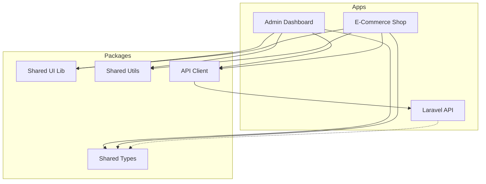

# Project Refactoring & Decoupling Plan

## 1. Overview & Analysis

### Current Architecture
The project is a **monorepo** containing three main services:
- **`chawkbazar-api`**: A Laravel-based REST API serving as the backend.
- **`admin` (@chawkbazar/admin-rest)**: A Next.js application for the admin dashboard.
- **`shop` (@chawkbazar/shop)**: A Next.js application for the e-commerce storefront.

### Pain Points & Coupling
1.  **Code Duplication**:
    -   **UI Components**: Both `admin` and `shop` contain their own `components/ui` directories with nearly identical components (e.g., `Button`, `Input`, `Alert`, `Drawer`). This leads to inconsistent styling and double maintenance.
    -   **API Logic**: Both frontends use `react-query` and `axios` with likely duplicated API hooks and type definitions.
    -   **Utilities**: Helper functions (date formatting, validation) are likely repeated.

2.  **Tight Coupling**:
    -   **Configuration**: `.env` files are manually managed, and services assume local ports (e.g., `localhost:3003`).
    -   **Build Process**: Custom scripts in `deployment/` (e.g., `frontendbuildscript.mjs`) suggest a fragile, manual build process rather than a standard CI/CD pipeline.

3.  **Scalability**:
    -   Without shared packages, adding a new frontend (like a Page Builder) requires copying components again, exacerbating the maintenance burden.
    -   The current structure makes it hard to deploy services independently with confidence that shared logic hasn't broken.

---

## 2. Refactoring Strategy

The primary goal is to **decouple** the services by extracting shared logic into internal packages. This allows each service to be thin, focused, and consistent.

### Decoupling Plan (Frontend ↔ Backend)
The Frontend and Backend are already loosely coupled at runtime (REST API). The focus here is on **Development Coupling**.

1.  **Shared UI Library (`packages/ui`)**:
    -   Extract common UI components (`Button`, `Input`, `Modal`, `Drawer`) into a shared React package.
    -   Use a tool like **Storybook** to develop and test these components in isolation.
    -   Ensure both `admin` and `shop` consume this package.

2.  **Shared Logic & Types (`packages/utils`, `packages/types`)**:
    -   **Types**: Shared TypeScript interfaces for API responses (User, Product, Order). This ensures `admin` and `shop` agree on the data structure.
    -   **Utils**: Common helpers (currency formatting, date manipulation).

3.  **API Client (`packages/api-client`)**:
    -   Create a shared package that wraps `axios` and `react-query` hooks.
    -   This ensures API calls are defined in one place. If an endpoint changes, you update it here, and both apps benefit.

### Recommended Directory & Repo Structure

We will transition to a standard **TurboRepo** or **Yarn Workspaces** structure with a dedicated `packages` directory.

```
/
├── apps/
│   ├── admin/          # Next.js Admin Dashboard
│   ├── shop/           # Next.js E-commerce Storefront
│   └── api/            # Laravel Backend (moved from chawkbazar-api)
├── packages/
│   ├── ui/             # Shared React UI Components (Tailwind)
│   ├── types/          # Shared TypeScript Interfaces
│   ├── utils/          # Shared Helper Functions
│   ├── api-client/     # Shared Axios/React-Query Hooks
│   └── config/         # Shared ESLint/Prettier/Tailwind configs
├── docker/             # Docker Compose & K8s manifests
├── package.json        # Root workspace config
└── turbo.json          # TurboRepo build pipeline config
```

### Architecture Diagram



---

## 3. Migration Plan

### Phase 1: Infrastructure Setup
1.  Initialize **TurboRepo** in the root.
2.  Move `admin/rest` to `apps/admin`.
3.  Move `shop` to `apps/shop`.
4.  Move `chawkbazar-api` to `apps/api`.
5.  Update root `package.json` workspaces.

### Phase 2: Extract Shared UI
1.  Create `packages/ui`.
2.  Move `Button`, `Input`, and `Typography` components from `shop` to `packages/ui`.
3.  Refactor `shop` to import from `@chawkbazar/ui`.
4.  Verify `shop` still works.
5.  Refactor `admin` to import from `@chawkbazar/ui`.
6.  Repeat for complex components (Drawers, Modals).

### Phase 3: Extract Logic
1.  Create `packages/types` and move interfaces.
2.  Create `packages/api-client` and move `react-query` hooks.

### Phase 4: Standardization
1.  Standardize `Dockerfile` for each app in `apps/*/Dockerfile`.
2.  Replace `deployment/` scripts with a standard GitHub Actions workflow that uses `turbo build`.

---

## 4. Future Expansion: Page Builder Service

To add a **Page Builder** that allows editing `shop` pages from `admin`:

1.  **Architecture**:
    -   The Page Builder should be a **feature within `admin`** or a **separate micro-frontend** that loads the *exact same* components as `shop`.
    -   Since we extracted `packages/ui`, the Page Builder can import `@chawkbazar/ui` to render a "live preview" that is 100% accurate to what users see in `shop`.

2.  **Data Storage**:
    -   Store page layouts as JSON in the database (Laravel).
    -   **Schema**:
        ```json
        {
          "sections": [
            { "type": "HeroBanner", "props": { "title": "Sale", "image": "..." } },
            { "type": "ProductGrid", "props": { "category": "shoes" } }
          ]
        }
        ```

3.  **Rendering**:
    -   **Shop**: Fetches layout JSON -> Maps `type` to `@chawkbazar/ui` components -> Renders page.
    -   **Page Builder**: Fetches layout JSON -> Renders editable wrappers around `@chawkbazar/ui` components.

---

## 5. Risks & Mitigation

| Risk | Impact | Mitigation |
| :--- | :--- | :--- |
| **UI Divergence** | `admin` and `shop` look different during migration. | Migrate one component at a time. Use visual regression testing (Chromatic). |
| **Build Complexity** | Monorepo builds become slow. | Use **TurboRepo** for caching. Only rebuild changed packages. |
| **Deployment Downtime** | Breaking changes in shared packages. | Version shared packages or use "Internal Packages" pattern (always latest). Use Blue/Green deployment. |

## 6. Next Steps & Timeline

-   **Week 1**: Setup TurboRepo, move directories, create `packages/ui`.
-   **Week 2**: Migrate core atoms (Button, Input) and setup Storybook.
-   **Week 3**: Migrate API hooks to `packages/api-client`.
-   **Week 4**: Standardize Docker & CI/CD.
